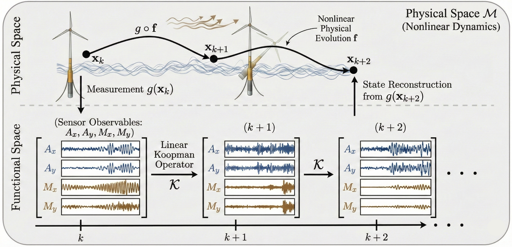

# Equation-Free Digital Twins for Nonlinear Structural Dynamics
## Concept at a glance

<p align="center">
  
</p>

<p align="center">
  <b>Equation-free digital twin workflow for nonlinear floating offshore wind turbine dynamics.</b>
</p>

## Missing/failed sensor reconstruction

<p align="center">
  
</p>

<p align="center">
  <b>Virtual sensing workflow for reconstructing missing or failed tower response channels.</b>
</p>
This repository accompanies the arXiv paper *Equation-Free Digital Twins
for Nonlinear Structural Dynamics* (arXiv:2605.00950) by Mohammad Mahdi
Abaei and co-authors. Its purpose is to provide a reproducible Python
implementation of the Hankel-DMD / Koopman-Hankel digital twin framework
and the rolling-horizon virtual-sensing methodology developed in that
paper. The central scientific contribution is the equation-free
identification of structural modes from operational sensor data and the
reconstruction of failed or never-installed tower sensors from the
remaining channels, demonstrated on a floating wind turbine. Everything
in this repository is organised around making that contribution
reproducible by independent users.

## Repository scope

This is a research codebase, not an OpenFAST distribution. The Python
package under `src/eftwin/` and the runnable scripts under `scripts/`
implement the Hankel-DMD identification, the SSI-COV cross-validation,
the rolling-horizon virtual sensing of failed sensors, the missing-sensor
generalisation experiment, the Hankel-delay sensitivity analysis that
produces the probabilistic mode shapes, the modal assurance criterion
validation against OpenFAST linear modes, and the Lyapunov-exponent
estimation of the predictability horizon. Those algorithms, and the
documentation and tests that surround them, are the primary product of
this repository.

The OpenFAST automation under `scripts/openfast/` is auxiliary. It
exists so that users who want to regenerate the underlying twelve-case
simulation dataset from scratch can do so using the customised case
templates this repository provides, but those scripts call out to a
separate OpenFAST installation that the user must obtain independently.
This repository does not bundle OpenFAST executables, dynamic-link
controller libraries, the NREL 5 MW baseline distribution files, the
turbulent wind-field binaries, or the simulation outputs. Users who
want to run the OpenFAST pipeline locally must install OpenFAST
themselves, obtain the 5 MW baseline files from NREL's reference test
repository, and follow the instructions in
`openfast/baseline/README.md` for laying everything out.

## Repository layout

The code is organised so that every layer is small and focused. The
`src/eftwin/` directory contains the reusable Python package, with one
module per algorithm family. The `scripts/` directory contains
runnable orchestration scripts split into `scripts/analysis/` for the
Hankel-DMD, virtual sensing, missing-sensor generalisation, SSI-COV,
probabilistic mode-shape, and MAC validation workflows, and
`scripts/openfast/` for OpenFAST case generation and post-processing.
The `configs/` directory holds the YAML configuration files that drive
the runners; every parameter that the original research scripts hardcoded
has been moved into a YAML field and documented there. The `openfast/`
directory holds the customised case-generation templates and a README
that points users at NREL for the underlying baseline files. The
`data/` directory holds a small synthetic sample for smoke testing and
documents how users place the full dataset locally. The `docs/`
directory contains the methodology, code inventory, data description,
OpenFAST pipeline, and reproduction guides. The `legacy/` directory
preserves the original research scripts unchanged except for two small
documented patches noted below. The `notebooks/` directory contains an
end-to-end tutorial that runs against the synthetic sample. The
`tests/` directory contains a smoke test suite that exercises every
core code path. The `results/` directory is the destination for
generated figures, tables, and saved models, with `.gitkeep`
placeholders so the structure survives a fresh checkout.

## Installation

The recommended setup uses conda for the heavy scientific dependencies
followed by an editable pip install of the package itself. The editable
install makes `eftwin` importable from anywhere on the system, which is
what the runner scripts and the tutorial notebook expect.

```bash
conda env create -f environment.yml
conda activate equation-free-dt
pip install -e .
```

The OpenFAST pipeline scripts additionally require either `pyFAST` or
`openfast_toolbox` to be installed in the same environment. Both are
commented out in `requirements.txt` because they depend on the specific
OpenFAST distribution available on the user's system, and the analysis
pipeline does not need either of them.

## Data placement

The full twelve-case dataset is approximately 500 MB and is therefore
not committed to this repository. Users who already have the dataset
should place it under `data/full/` following the `Case_<N>.csv`
convention. Users who want to regenerate the dataset from scratch
should follow `docs/openfast_pipeline.md` to run the OpenFAST case-
generation scripts; the resulting `.outb` files are then converted to
the analysis CSVs with `scripts/openfast/export_dmd_csv.py`. The
expected layout is:

```
data/full/Case_1.csv
data/full/Case_2.csv
...
data/full/Case_12.csv
```

The data loader inside `src/eftwin/data_io.py` validates each loaded
case against the configured `dt = 0.0125 s` and raises a
`DTMismatchError` if the actual time spacing differs by more than 0.0001
seconds. This guards against the common mistake of exporting at
OpenFAST's `DT_Out` rate (typically 0.05 s) instead of at the simulation
`DT` rate. If you hit this error, either re-export your cases with
`DT_Out = DT` in the OpenFAST input deck, or update the `dt` field in
your YAML configuration to match what your CSV files actually contain.

## Quick smoke test

The repository ships with a small synthetic CSV under `data/sample/` so
that you can verify the installation without the full dataset. The
synthetic data does not reproduce the paper's modal structure; its only
purpose is to confirm that the loaders, the band-pass filter, the
Hankel-DMD fit, and the plotting pipeline execute without error.

```bash
mkdir -p data/full
cp data/sample/sample_case_small.csv data/full/Case_1.csv
python scripts/analysis/run_hankel_dmd.py --config configs/hankel_dmd.yaml
```

## Running the full paper pipeline

Once the twelve-case dataset is in place under `data/full/`, the paper
results are reproduced by running the analysis scripts in the order
shown below. Each script reads its parameters from a YAML
configuration file under `configs/`. The defaults in those files match
the parameter values used in the paper.

```bash
python scripts/analysis/run_hankel_dmd.py --config configs/hankel_dmd.yaml
python scripts/analysis/run_virtual_sensing.py --config configs/virtual_sensing.yaml --direction fore_aft
python scripts/analysis/run_virtual_sensing.py --config configs/virtual_sensing.yaml --direction side_to_side
python scripts/analysis/run_missing_sensor_generalization.py --config configs/missing_sensor_generalization.yaml --direction fore_aft
python scripts/analysis/run_missing_sensor_generalization.py --config configs/missing_sensor_generalization.yaml --direction side_to_side
python scripts/analysis/run_ssi_cov.py --config configs/ssi_cov.yaml --direction fore_aft
python scripts/analysis/run_ssi_cov.py --config configs/ssi_cov.yaml --direction side_to_side
python scripts/analysis/run_ssi_stabilization.py --config configs/ssi_cov.yaml --direction fore_aft
python scripts/analysis/run_probabilistic_modes.py --config configs/probabilistic_modes.yaml
python scripts/analysis/run_mac_validation.py --config configs/mac_validation.yaml
```

The missing-sensor generalisation runner is the script that reproduces
the paper's central virtual-sensing contribution: it fits a Hankel-DMD
model on the first eight cases of the wave-load sweep, masks
user-selected tower sensor channels (default: lowest and highest
acceleration gauges), and reconstructs them on the four unseen test
cases. The reconstruction accuracy reported per masked sensor (R
squared, RMSE, NRMSE) is what supports the paper's claim that the
equation-free digital twin can recover failed sensors at operational
sampling rates with R squared above 0.99 across unseen wave-load
conditions.

The MAC validation runner depends on the outputs of the Hankel-DMD and
SSI-COV runners plus an `Extracted_Mode_Shapes.xlsx` file produced by
running the OpenFAST linearisation post-processor. To produce that
Excel file from a `.lin` output, use:

```bash
python scripts/openfast/extract_linear_modes.py \
    --lin-file outputs_lin/parametric/case_1.1.lin \
    --output results/tables/Extracted_Mode_Shapes.xlsx
```

The `extract_linear_modes.py` script accepts the input `.lin` file and
the desired output path on the command line; it is the cleaned wrapper
for the legacy `Modal_OutPut_Final_02.py` script and replaces the
hardcoded paths in that legacy file with proper command-line arguments.

## OpenFAST pipeline (auxiliary)

The OpenFAST scripts under `scripts/openfast/` are an auxiliary
data-generation pipeline. They exist for users who want to regenerate
the simulation data rather than obtain it from a published dataset.
Running them requires a working OpenFAST installation (which this
repository does not provide), the NREL 5 MW baseline files (which this
repository does not redistribute; see `openfast/baseline/README.md` for
where to obtain them), and either `pyFAST` or `openfast_toolbox` in
the Python environment. Once those prerequisites are in place, the
pipeline runs as:

```bash
python scripts/openfast/generate_nonlinear_cases.py --config configs/openfast_cases.yaml --run
python scripts/openfast/generate_linear_cases.py --config configs/openfast_cases.yaml --run
python scripts/openfast/export_dmd_csv.py --input-dir outputs/parametric --output-dir data/full --n-cases 12
```

The first command generates and runs the twelve nonlinear cases for the
wave-load sweep. The second generates and runs the linearisation case
at the rated operating point. The third exports the relevant channels
from each `.outb` simulation output to a `Case_<N>.csv` analysis file
that the Hankel-DMD pipeline can read.

## Tutorial notebook

The Jupyter notebook at `notebooks/01_hankel_dmd_tutorial.ipynb`
provides a sixteen-cell end-to-end walkthrough that loads the data,
fits the Hankel-DMD model, displays the eigenvalue stability map,
extracts physical mode shapes, runs a virtual-sensing reconstruction,
and performs the SSI-COV comparison. It is designed to run against the
synthetic sample data without modification, and against the full
dataset by changing the `DATA_DIR` constant in the first code cell.

## Original scripts and traceability

Every original research script is preserved under `legacy/`. The
`legacy/hankel_dmd_original/` directory contains the ten original
Hankel-DMD analysis scripts and the `legacy/openfast_original/`
directory contains the five original OpenFAST automation scripts. The
mapping between each original script and the cleaned module that
implements its methodology is documented in `docs/code_inventory.md`,
and the algorithmic correspondence is explained in `docs/methodology.md`.

Two of the original scripts contained syntax issues that prevented
them from being imported as Python modules without modification:
`Linearize_ParametricInputs.py` had a non-Python placeholder line in
its post-processing section, and `Missing_Sensor_Generalization_2 2.py`
had a markdown text block appended after the closing code block. Both
files have been patched only at the syntactic level: the broken lines
have been commented out so that the files now parse, and the original
broken content is preserved verbatim inside the comments for
provenance. No working numerical code has been modified in either
file. The cleaned, importable equivalents of the same workflows live
in `src/eftwin/openfast_pipeline.py` and `src/eftwin/virtual_sensing.py`
respectively, with corresponding runner scripts and YAML configs.

The cleaned modules preserve the original numerical workflow,
parameter defaults, and algorithmic sequence; the original scripts are
retained for traceability rather than being treated as ground truth
for downstream development.

## Citation

If you use this code in your research, please cite the associated paper:

> Abaei, M. M., BahooToroody, A., Polojärvi, A., Remes, H., Tygesen, U. T.,
> Suominen, M., and Beer, M. (2026). *Equation-Free Digital Twins for
> Nonlinear Structural Dynamics*. arXiv:2605.00950.

A `CITATION.cff` file is provided at the repository root for automated
citation managers.

## License

This repository is released under the MIT License. See the `LICENSE`
file for the full text. This licence applies to the source code and
documentation in this repository only; the NREL 5 MW baseline files
referenced by the OpenFAST pipeline are distributed separately by NREL
under their own terms.
